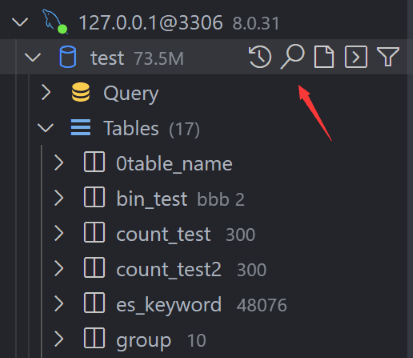
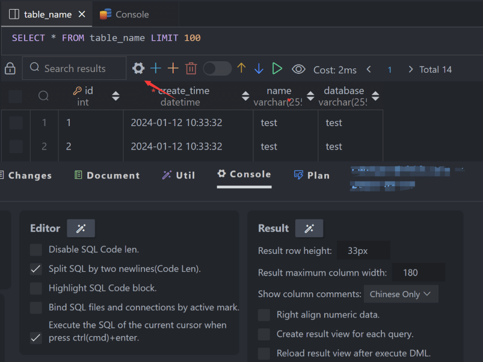

# Database Client

#### This repository contains the early source code. The new version is closed source.

---

This project is a database client for Visual Studio Code, supporting the management **MySQL/MariaDB, PostgreSQL, SQLite, Redis, ClickHouse, 达梦**, and **ElasticSearch**, and works as an **SSH** client, boost your maximum productivity!

> Project site: [vscode-database-client](https://github.com/cweijan/vscode-database-client), [中文文档](README_CN.md)

## Installation

Install from the [Visual Studio Code Marketplace](https://marketplace.visualstudio.com/items?itemName=cweijan.vscode-mysql-client2) or [Open VSX](https://open-vsx.org/extension/cweijan/vscode-mysql-client2).

## Telemetry Reporting

The Database Client extension will collects and sends anonymous usage data to the Database Client server to help improve our products and services. Read our [Privacy Statement](https://database-client.com/#/privacyPolicy) to learn more.

Telemetry reporting follows the telemetry settings of VS Code. Additionally, you can independently disable it by setting `"database-client.telemetry.usesOnlineServices": false`.

## Connect

1. Open Database Explorer panel, then click the `+` button.
2. Select your database type, input connection config then click the connect button.

## Table

1. Click table to open table view.
2. Click button beside table to open new table view.
3. Then you can do data modification on the table view.

## Execute SQL Query

In the Database Explorer panel, click the `Open Query` button.

That will open a SQL editor bind of database, it provider:

1. IntelliSense SQL edit.
2. snippets:`sel、del、ins、upd、joi`...
3. Run selected or current cursor SQL (Shortcut : Ctrl+Enter).
4. Run all SQL (Shortcut : Ctrl+Shift+Enter, Command ID: `mysql.runSQL`).

The database can be searched by clicking the search button to the right of "Tables".

## Cache

In order to improve performance, the database information is cached. If your database structure changes externally, you need to click the refresh button to refresh the cache。

## Backup/Import

Move to ant DatabaseNode or TableNode. The export/import options are listed in the context menu (right click to open).

The extension implements the backup function, but it is not stable enough. You can add mysql_dump or pg_dump to the environment variable, and the extension will use these tools for backup.

## Setting

The extension provides some settings, you can refer to the following operations to go to the console settings.

## Generate Mock Data

You can easily generate test data.

## History

Click the history button to open the list of recently executed query history records.

## Credits

- [ssh2](https://github.com/mscdex/ssh2): SSH client.
- [sql-formatter](https://github.com/zeroturnaround/sql-formatter) SQL format lib.
- Client Lib:
  - [node-mysql2](https://github.com/sidorares/node-mysql2) : MySQL client.
  - [node-postgres](https://github.com/brianc/node-postgres): PostgreSQL client.
  - [tedious](https://github.com/tediousjs/tedious): SqlServer client.
  - [ioredis](https://github.com/luin/ioredis): Redis client.
  - [vscode-sqlite](https://github.com/AlexCovizzi/vscode-sqlite): SQLite client code reference.